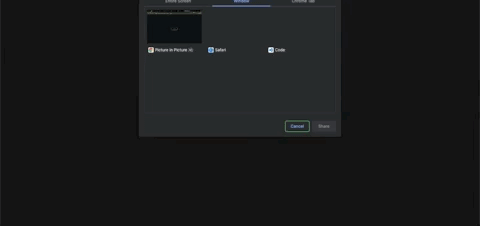

# Picture in Picture with vanilla JS & CSS

## About The Project

This is a small project to showcase how you can use JavaScript to have Picture in Picture mode.
I have applied small CSS animation to the background and button. You can see that the background has a static effect (Hey, millenials! Remember television?). And an animated button.
When you refresh the screen, your browser will guide you to select your screen. Once you click the "START" button, the little responsive picture will appear, and you can place it anywhere on your screen.
Imagine you're working,but you want to keep an eye on the score of your favorite team. Or have a relaxing fireplace video. This is how you can achieve this.
You can apply it to your own projects or simply learn the methods used.
Please fell free to contribute.

## Preview

## Built With

You should be familiar with JavaScript basics, but I have linked the methods used for this project.

- [Media Devices](https://developer.mozilla.org/en-US/docs/Web/API/MediaDevices)
- [Media Element](https://developer.mozilla.org/en-US/docs/Web/API/HTMLMediaElement/srcObject)
- [onloadmetadata Event](https://www.w3schools.com/jsref/event_onloadedmetadata.asp)
- [.disabled property](https://www.w3schools.com/jsref/prop_select_disabled.asp)

## Installation

This is a working code example.
You can copy the CSS and Javascript code as is and use it in your projects.
Or you can download the code as a ZIP file and unzip it. No web server required, you can see it live through your localhost by opening index.html with your browser. Alternatively, you can open your project with VS Code (download live server extension) and click on **Go Live** at the bottom right corner, it should open in your default browser.

## Contributing

1. Fork the Project
2. Create your Feature Branch (`git checkout -b feature/AmazingFeature`)
3. Commit your Changes (`git commit -m 'Add some AmazingFeature'`)
4. Push to the Branch (`git push origin feature/AmazingFeature`)
5. Open a Pull Request

## License

MIT License

Copyright (c) 2021 Shay Asanova

Permission is hereby granted, free of charge, to any person obtaining a copy
of this software and associated documentation files (the "Software"), to deal
in the Software without restriction, including without limitation the rights
to use, copy, modify, merge, publish, distribute, sublicense, and/or sell
copies of the Software, and to permit persons to whom the Software is
furnished to do so, subject to the following conditions:

The above copyright notice and this permission notice shall be included in all
copies or substantial portions of the Software.

THE SOFTWARE IS PROVIDED "AS IS", WITHOUT WARRANTY OF ANY KIND, EXPRESS OR
IMPLIED, INCLUDING BUT NOT LIMITED TO THE WARRANTIES OF MERCHANTABILITY,
FITNESS FOR A PARTICULAR PURPOSE AND NONINFRINGEMENT. IN NO EVENT SHALL THE
AUTHORS OR COPYRIGHT HOLDERS BE LIABLE FOR ANY CLAIM, DAMAGES OR OTHER
LIABILITY, WHETHER IN AN ACTION OF CONTRACT, TORT OR OTHERWISE, ARISING FROM,
OUT OF OR IN CONNECTION WITH THE SOFTWARE OR THE USE OR OTHER DEALINGS IN THE
SOFTWARE.

## Contact

shay[dot]asanova[at]gmail[dot]com
